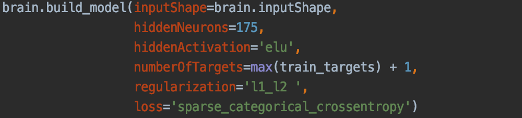

The Emotiv^®^ EPOC+
-------------------

Although easily modifiable, the MusEEG package is designed to work with
the Emotiv^®^ EPOC+. The EPOC+ is an affordable commercial-grade EEG
headset that records 14 EEG channels and samples at a rate of 256Hz with
14-bit resolution, with a least significant bit value of approximately
0.51 $\mu$V. The EPOC+ headset proves to be an economically feasible
alternative to a medical-grade headset as various studies confirm its
viability for noncritical applications.

Data Acquisition
----------------

To maximize classification accuracy, the MusEEG package is designed with
a train-it-yourself structure, meaning that the end-user will have to
train their own ANN model to work with their preferred set of facial or
body expressions. Because of the train-it-yourself nature of the
package, data was recorded for a single subject only. Six facial
expressions were recorded using the Emotiv^®^ PRO application. 80
samples were recorded of the following facial expressions:

-   smile

-   raise eyebrows

-   look left

-   look right

-   neutral

-   scrunch

To expedite recording times, the MusEEG package was designed to allow
the user to record all samples of a single facial expression to a single
.csv file. The MusEEG package then aids the user through curating and
cutting the samples into individual chunks for feature extraction and
classification.

During the curation process, the samples were examined for any
discontinuities in contact quality, noise, and other artifacts. Samples
that appeared to be corrupted with electrode contact discontinuities
were discarded, while samples that were clean were stored in the
project's saved chunks directory. From each sample, two different sample
chunks were created: a *bigChunk* (1250ms, 320 samples) for facial
expression recognition, and a *smallChunk* (250ms, 64 samples) for
facial expression/no facial expression classification. Examples of a
*bigChunk* and *smallChunk* can be observed in
(Figures [3.2](#fig:smileBigChunk) and
[3.3](#fig:smileSmallChunk)), respectively.

Feature Extraction
------------------

### Facial Expression Feature Extraction

A feature extraction method similar to the one in [@14] was used. A
4-level wavelet decomposition using Daubechies order-2 (db2) mother
wavelet is performed on all 14 channels of the chunk of EEG data.

One advantage of wavelet analysis over other time-frequency distribution
methods (e.g. STFT) is that wavelet analysis varies the time-frequency
aspect ratio, producing good frequency localization at low frequencies
(long time windows) and good time localization at high frequencies
(short time windows). This results in a segmentation of the
time-frequency plane that will reveal transient features of the signal,
which are typically not obvious during Fourier analysis [@14].

Following the wavelet decomposition, the first four statistical moments
(mean, variance, skewness, kurtosis) are calculated for each wavelet
vector. Since four moments are calculated for each of the 5 wavelet
decomposition vectors per EEG channel, a total of 14 x 4 x 5 (280)
features are calculated. The data is then normalized using *sklearn*'s
MinMaxScaler. These features are used as an input for the classification
models.

### Band Power Feature Extraction

The MusEEG system is capable of sending continuous theta (4 - 8 Hz),
alpha (8 - 12 Hz), beta (12 - 30 Hz), and gamma (30 - 60 Hz) band power
information at a rate of 2Hz.

Before the average band power is calculated, the power spectral density
of all of the 14-channel data is calculated using Welch's periodogram,
with a window duration of 0.5s. Once the power spectral density is
calculated, the average band power over a certain range of frequencies
is found by integrating the power spectral density over the frequency
ranges.

Classification
--------------

A three-layer Artificial Neural Network (ANN) architecture was used for
the classification of the EEG signals. Two models were created: a small
model designed to analyze 64-sample chunks and determine whether the
chunk contains a facial expression or not (*smallBrain*), and a large
model designed to analyze 320-sample chunks to determine what facial
expression is present in the chunk (*bigBrain*).

The *smallBrain* model is meant to perform a quick classification of
whether a facial expression is present in a 64-sample chunk. The
*smallBrain* model was designed with the intent of having an always-on
processor for real-time implementation. By analyzing a chunk with a
duration of 250ms, the *smallBrain* model returns a result fairly
quickly, allowing for continuous real-time classification with little
latency.

The *smallBrain* model consists of a three-layer ANN with L1
regularization methods and a sparse categorical cross entropy loss
function. During testing, the model exhibited 98.75% accuracy. Its test
confusion matrix can be observed in
(Figure [3.7](#fig:smallBrainConfusion)) .

The *bigBrain* model consists of a three-layer ANN with L1\_L2
regularization methods and a sparse categorical cross entropy loss
function. During testing, the model exhibited 87.04% accuracy. Its test
confusion matrix can be observed in
(Figure [3.9](#fig:bigBrainConfusion)).

