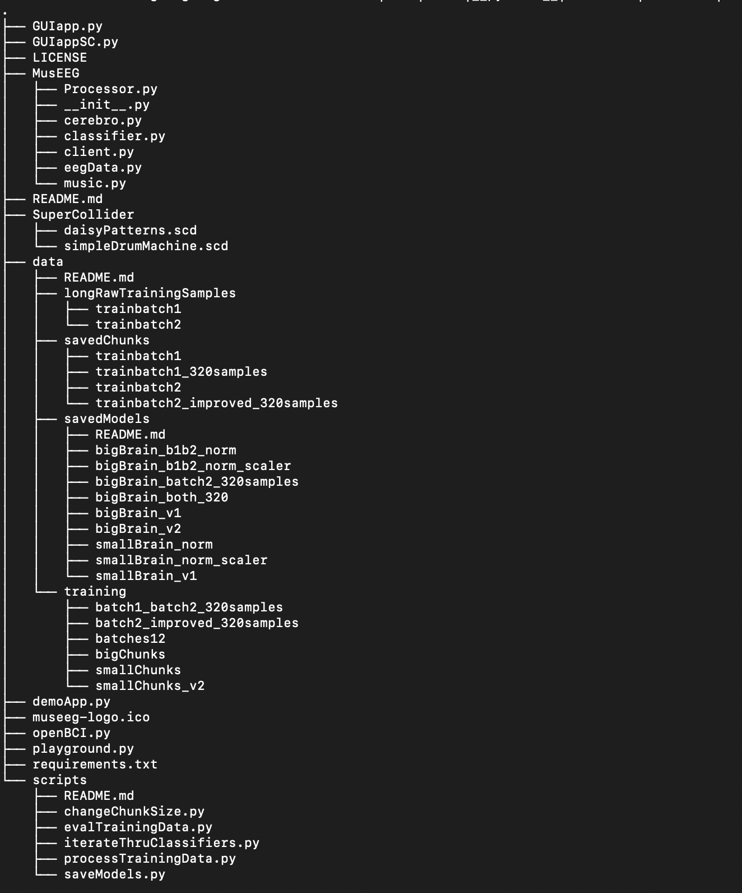
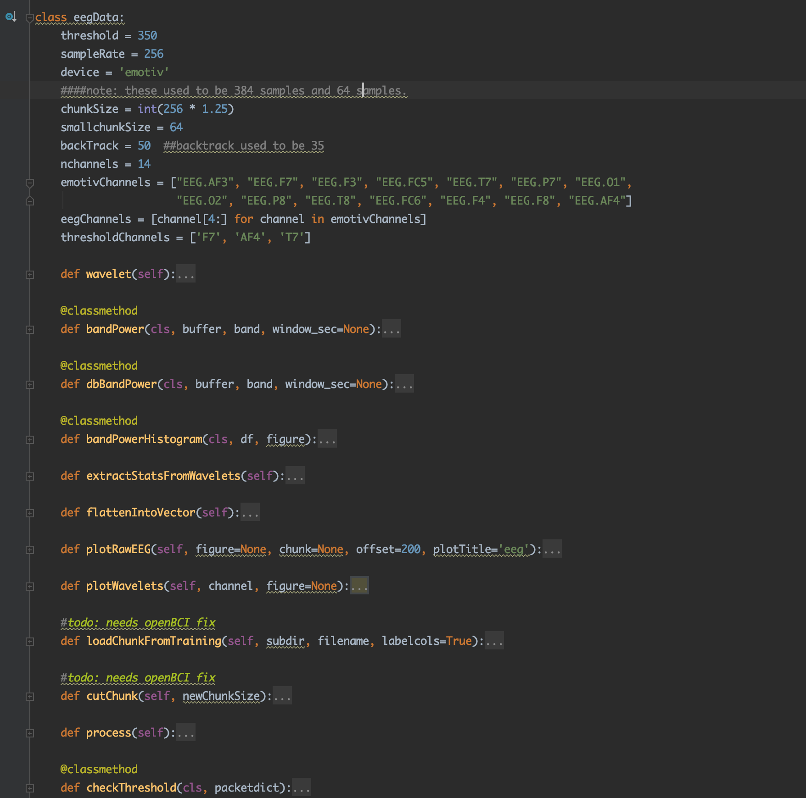

The MusEEG root directory
(Figure [4.1](#fig:projectStructure)) consists of a data directory, an
example scripts directory, the MusEEG library, a README file, a library
requirements file, a demo application, and an MIT License file.

The Data Directory
------------------

The /data directory of the MusEEG module stores EEG data in all of its
different training stages, inputs and targets for the ANN models, as
well as the ANN models themselves. The /data/longRawTrainingSamples
subdirectory stores .csv files with multiple samples of a single
gesture. During the normal workflow of the data acquisition process, the
files from the longRawTrainingSamples subdirectory are curated and
stored into individual chunks in the /data/savedChunks subdirectory,
which in itself contains subdirectories for smallChunks and bigChunks.
The /data/savedModels subdirectory saves Keras models that have been
trained and are ready for usage, while the /data/training subdirectory
stores preprocessed and prelabeled input and target vectors for
designing ANN models.

MusEEG Library
--------------

The MusEEG library contains all the required classes to build a
brain-computer interface for music performance. It is organized into
five modules:

-   eegData.py (import, process, plot, save EEG data).

-   music.py (MIDI objects, chords, and melodies)

-   classifier.py (build, train, save keras models easily)

-   cerebro.py (methods to use music, classifier, and eegData together)

-   client.py (TCP client setup to receive live raw EEG data stream from
    EPOC+ headset and stream .csv giles)

-   Processor.py (real-time processing and OSC communication)

The eegData class (Figure [4.2](#fig:eegDataClass)) helps a user import raw EEG data from
.csv files, curate it into processable chunks, process using wavelet
decomposition and statistical extraction, as well as plot the 14-channel
EEG signal or the five coefficient vectors created by the wavelet
decomposition. It is currently designed around the EPOC+ model, but can
be redesigned for any other EEG system, provided that the developer has
a means of obtaining a raw EEG stream from such system. The eegData
class builds upon the PyWavelets, matplotlib, SciPy, and Pandas Python
libraries.

The music class (Figure [4.3](#fig:musicClass)) is designed to allow the user to create,
load, and save different MIDI events for use during performance. As of
now, the music class allows the creation of chord and melody objects,
though future iterations will also include the option to load
pre-written MIDI files created using third-party MIDI sequencing
software. The music class is built upon the Mido and Audiolazy
libraries.

The classifier class
(Figure [4.4](#fig:classifierClass)) builds upon the TensorFlow and Keras
libraries to expedite the process of creating, training, loading,
saving, and analyzing the performance of ANN models.

The cerebro class serves as a high-level API for less experienced
programmers to make use of the MusEEG package, as it contains methods
that use the eegData, classifier, and music classes in conjunction to
create brain-computer music interface systems. The cerebro class is
built on top of the eegData, music, classifier, and client classes from
the MusEEG package.

The client class (Figure [4.6](#fig:clientClass)) sets up a TCP client that receives raw EEG
data packets from an EEG stream server and packs them into chunks to
create eegData objects. The client class is also capable of creating a
raw EEG streaming simulation by effectively streaming a pre-recorded
.csv EEG session into the server.

The processor class
(Figure [4.7](#fig:processorClass)) contains real-time processing methods
that communicate with the client and eegData classes to perform
real-time EEG classification and MIDI/OSC processing as described in
(Figure [5.2](#fig:realTimeFlowChart)) and
(Figure [5.4](#fig:processorwithwakeup)).

Example Scripts
---------------

The MusEEG/scripts directory contains a series of sample scripts that
can be useful during the creation of a user's training samples and ANN
model.

evalTrainingData.py provides an example of importing long .csv files
that contain multiple samples of the same gesture from the
MusEEG/data/longRawTrainingSamples directory and using the
TrainingDataMacro class to evaluate, curate, and save individual
training samples to the /data/savedChunks directory.

processTrainingData.py grabs the curated chunks from the
/data/savedChunks directory and performs the preprocessing and feature
extraction routine (wavelet transform and statistical extraction), as
well as creates training inputs and targets and stores them in the
/data/training directory.

Because the dataset is quite small and one-dimensional, training ANN
models is relatively computationally inexpensive. This lets a user
perform an exhaustive search of different ANN models with different
activation units, hidden layer sizes, and regularization parameters
within the span of a couple of minutes. iterateThruClassifiers.py
iterates over every combination of different hidden layer activation
functions, output layer activations, regularization parameters, number
of hidden neurons, and loss functions to find the one that performs with
the highest accuracy. The iterateThruClassifiers.py script creates a
.csv file in the /data/ClassifierOptimizations directory which contains
the test results for each of the combinations tried. saveModels.py
trains and saves a Keras model in the /data/savedModels directory.
