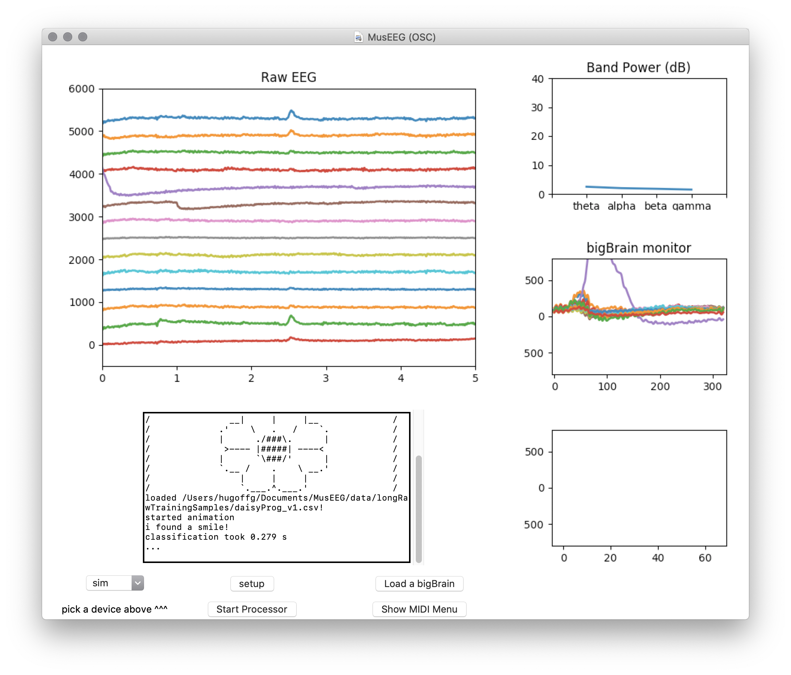

The MusEEG package is a Python package containing useful classes that
aid developers in preprocessing and classifying EEG data, creating MIDI
objects, instantiating an OSC client, and designing a Brain-Computer
Music Interface that allows a user to trigger MIDI events and OSC
messages from performing facial expressions. The MusEEG project is
available as an open-source package and can be downloaded from its
GitHub repository[^1].

Regarding Open Source Privacy Concerns
--------------------------------------

Due to the open-source, train-it yourself nature of the MusEEG project,
a particular subject's EEG data is handled by only the subject himself,
as it is advised that the neural network model is trained for a single
individual only for higher classification accuracy. In order for a user
to create their own personalized neural network model, the user must
first download the MusEEG package from GitHub to their personal
computer. The MusEEG eegData module's training methods facilitate the
data collection process, organizing and labeling the training data into
processing chunks inside the MusEEG directory. The processed and labeled
training data is then used to create and train a new neural network
model customized to the user's training data, which will also be stored
inside the MusEEG directory. It should be noted that all of the EEG data
acquired by the user is processed and saved inside the user's local
MusEEG directory and is never uploaded to the web. Thus, each user's EEG
data and trained neural network models reside inside the same user's
computer, and are never shared, accessed, or viewed by any other subject
without the original user's consent and deliberate intent.

Demo Application
----------------

The demo application was created as a static proof-of-concept that
provides a demonstration of the basic functionality of the MusEEG
package. In short, the MusEEG demo application lets the user perform the
following actions:

-   Create a MIDI chord dictionary by entering note names next to the
    desired facial expression.

-   Load a pre-recorded facial expression sample from the dataset.

-   Process the pre-recorded sample using wavelet decomposition as well
    as perform the statistical moments calculation.

-   Classify the pre-recorded facial expression sample using the
    *bigBrain* classifier.

-   Refer the resulting facial expression from the classification result
    to its corresponding chord in the MIDI dictionary.

-   Send the MIDI event to a virtual MIDI port with a set of
    music-related control parameters (arpeggiation, tempo, sustain
    duration, arpeggio note duration).

### The Facial Expression Buttons and Chord Dictionary

The top left corner of the demo application allows the user to load a
random sample from the existing facial expression dataset by pressing on
one of the facial expression buttons. Once loaded, the 14-channel raw
EEG signal will be plotted in the plot box. Next to each facial
expression button is a text entry field that allows the user to define
the set of notes that will be played when the facial expression is sent
to the main processor. Note: whenever the user changes notes in the
chord dictionary, the update chord dictionary button must be pressed in
order for the changes to take effect.

### Process and Send Button

The process and send button performs the following actions:\
1. wavelet transform of raw EEG signal\
2. statistical moment calculations of wavelet decomposition vectors\
3. creates ANN input array from extracted stat moments\
4. the ANN classifies the signal into either of the available facial
expressions\
5. the facial expression is referred to its matching chord in the chord
dictionary, and a chord object is created from the matching chord\
6. the playchord method is called on the chord object, sending a MIDI
message according to the additional control parameters 

### Additional Controls

Additional controls are available for the demo app:\
• arpeggiate: if the box is checked, the chord will play in an arpeggio
as opposed to vertically.\
• sustain duration: indicates how long (in quarter notes) the chord will
be sustained (only applied if arpeggiate is unchecked)\
• arpeggio note duration: indicates how long (in quarter notes) each
note in the arpeggio will last.\

Real-Time Processing
--------------------

Two different real-time processing algorithms were designed for MusEEG.
Though both use the same preprocessing and classification methods
(discussed in ), their methods for segmenting the raw EEG data into
analyzable chunks are distinct.

### Real Time Processing with *smallBrain* Wake Up

A flowchart describing the real-time processing workflow using
*smallBrain* wake up is described in
(Figure [5.2](#fig:realTimeFlowChart)).

In the client thread, a TCP client receives single EEG data packets from
a live EEG stream using the EPOC+. Each packet is placed into a python
queue, waiting to be retrieved by the main processing thread when
requested. A copy of this queue additionally stores 128 sample buffers
to be acquired by the band power processing thread.

In the main processing thread, a *chunkGetter* thread takes care of
receiving EEG packets from the client thread and placing them into
*smallChunk*s (64 samples). A \"small\" ANN model (*smallBrain*)
classifies the *smallChunk* into either a facial expression/no facial
expression result. If a facial expression is found, a wake up call is
sent to the *bigBrain* classifier (320 samples), where facial expression
classification takes place.

The classification result is sent to a message thread, which in turn
performs the predefined MIDI event indicated by the facial
expression-MIDI dictionary, or sends the designated OSC message for each
facial expression.

The band power processing thread takes care of retrieving 128 sample
(0.5s) chunks from the client and computing band power data by using the
aforementioned feature extraction algorithm. Band power values are then
sent as OSC messages, where they can be used as musical control
parameters in a sound processing application such as Max/MSP or
SuperCollider.

### Real Time Processing with Rising Edge Wake Up

A flowchart for this real-time processing algorithm is provided in
(Figure [5.4](#fig:processorwithwakeup)). This is the algorithm implemented
in the current release of the MusEEG app, as it provides a less
error-prone approach to segmenting facial expressions into analyzable
chunks.

In this algorithm, the client, band power and MIDI/OSC message threads
remain the same as the previous algorithm, while the main processsing
thread proposes a simpler approach.

In this algorithm's main processing thread, single raw EEG samples are
retrieved from the client's queue and compared with a threshold voltage.
If the magnitude of the packet's voltage surpasses the threshold
voltage, the *bigBrain* classifier is woken up, where it classifies the
chunk to a facial expression.

The classification result is sent to a message thread, which in turn
performs the predefined MIDI event indicated by the facial
expression-MIDI dictionary, or sends the designated OSC message for each
facial expression.

Because the real time processor with *smallBrain* wake up performs a
full dedicated analysis on the transient data, it is able to detect
facial expressions with smaller voltage magnitudes, making it a feasible
option for classification of motor imagery commands. However, this can
also lead to multiple false detection results that lead to a neutral
classification result from the classifier.

On the other hand, the real time processor with rising edge wake up is
only able to detect facial expressions with high voltage magnitude, but
it does so with more confidence. It was observed that the rising edge
wake up algorithm provided more favorable results during unit testing.
However, this algorithm might not perform well in MI classification
systems.

Graphical User Interface
------------------------

The MusEEG Graphical User Interface (GUI)
(Figure [5.5](#fig:museeg-gui)) was designed to allow the user to perform
the following actions:

-   select their desired EEG device (MusEEG currently supports the
    Emotiv EPOC+, and prerecorded .csv files),

-   open the MIDI menu, which contains a control center for modifying
    the MIDI messages assigned to facial expressions and the way the are
    performed on the system.

-   load a custom *bigBrain* model, and

-   view several monitoring windows for the raw EEG data, *bigBrain*
    data chunks, and average band power over all channels.

In addition, a post window prints classification results and other
useful messages from the backend.

\-

### The MIDI Menu

MusEEG's MIDI menu allows users to assign custom chords to facial
expressions and control the way the are performed, such as:

-   save the current MIDI-facial expression dictionary

-   load a stored MIDI-facial expression dictionary

-   set sustain duration for non-arpeggiated chords

-   arpeggiate the chord

-   (if the chord is arppegiated) scramble the arpeggio note order

-   set the number of repeats for the arpeggio pattern.

Open Sound Control
------------------

MusEEG offers a simple OSC module that wraps on top of the open-source
osc4py3 library. The module introduces availability to refer
user-defined OSC messages and bundles to facial expressions, and builds
a client that sends said messages over a network in the message thread.

[^1]: To access the MusEEG GitHub repository visit:
    https://github.com/hugofloresgarcia/MusEEG
