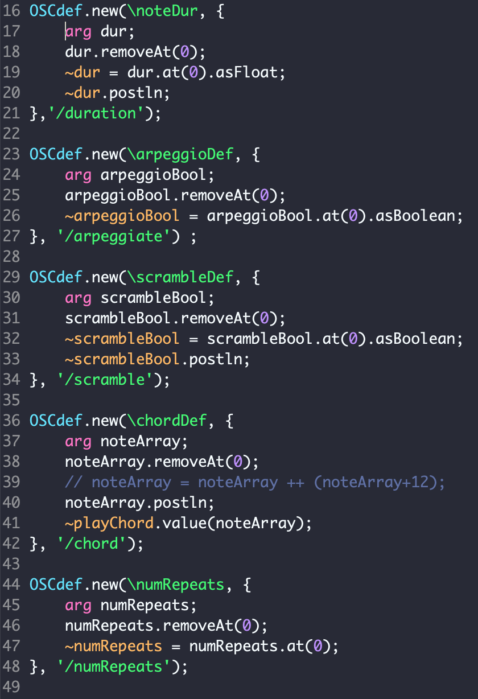

Because of the limited amount of discrete commands MusEEG is able to
send, it may be helpful for users to control higher level musical events
(such as chords, phrases, drum beats, or pre-recorded samples) instead
of singular notes. The SuperCollider programming language facilitates
the creation of such objects, and may act as a dedicated musical server
that responds to OSC commands sent from MusEEG.

OSCdefs
-------

OSCdefs are SuperCollider objects that execute a callback function when
a specific OSC message is received. In
(Figure [6.1](#fig:oscdefs)), a distinct callback function is assigned to
each facial expression and band power message, allowing for different
facial expressions to send control commands to user-specified musical
objects.

Using SuperCollider as a MIDI server
------------------------------------

SuperCollider's innately friendly MIDI API makes it a more favorable
option for programming MIDI patterns than Python. Because of this,
MusEEG's MIDI interface
(Figure [5.6](#fig:midi-menu)) simply sends OSC messages containing
information regarding the chord chosen and some additional control
paremeters: arpeggiation, number of repeats, chord duration, and note
scrambling. On the other hand, a SuperCollider script takes care of
receiving the OSC messages and creating the specified MIDI messages.

The playChord function
(Figure [6.3](#fig:playchord)) allows for MIDI messages to be sent in a
quantized manner, allowing asynchronously performed facial expressions
to have a synchronous effect on the music being performed, and thus
rendering a more accessible work flow.

The Pattern System
------------------

SuperCollider's pattern system provides a simple way of sequencing
synthesizer sounds. The MusEEG package includes two examples that
demonstrate ways SuperCollider's pattern system may be used in
conjunction with MusEEG to control higher level musical events.

### A Simple Drum Sequencer

(Figure [6.1](#fig:oscdefs)) shows the facial expression callback functions
for a drum sequencer pattern in SuperCollider. In this example, the
following facial expression controls are enabled:

-   A smile expression toggles a kick drum sound in a drumbeat.

-   A scrunch expression toggles a hi-hat drum sound in a drumbeat.

-   A hard blink expression toggles a snare drum sound in a drumbeat.

-   A look left expression decreases the beat tempo by 5 bpm.

-   A look right expression increases the beat tempo by 5 bpm.

### A Generative Arpeggio Pattern

(Figure [6.1](#fig:oscdefs)) shows the facial expression callback functions
for a generative arpeggio pattern in SuperCollider. In this particular
pattern, a note is chosen randomly from a chord array. Once a note is
chosen, the chosen note itself (or one of its overtones) is played
through a synthesizer of the user's choice. This process is then
repeated over time at a certain density.

In this example, the following facial expression controls are enabled:

-   A smile expression randomly chooses a new chord from a pre-existing
    chord bank.

-   A scrunch expression increases the number of overtones to choose
    from.

-   A hard blink expression decreases the number of overtones to choose
    from.

-   A look left expression decreases note density with respect to time.

-   A look right expression increases note density with respect to time.
