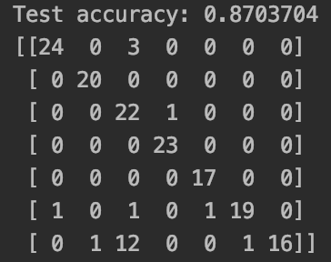

A three-layer Artificial Neural Network (ANN) architecture was used for the classification of the EEG signals. Two models were created: a small model designed to analyze 64-sample chunks and determine whether the chunk contains a facial expression or not (smallBrain), and a large model designed to analyze 320-sample chunks to determine what facial expression is present in the chunk (bigBrain).

The smallBrain model is meant to perform a quick classification of whether a facial expression is present in a 64-sample chunk. The smallBrain model was designed with the intent of having an always-on processor for real-time implementation. By analyzing a chunk with a duration of 250ms, the smallBrain model returns a result fairly quickly, allowing for continuous real-time classification with little latency.

The smallBrain model consists of a three-layer ANN with L1 regularization methods and a sparse categorical cross entropy loss function. During testing, the model exhibited 98.75% accuracy. Its test confusion matrix can be observed below.

The bigBrain model consists of a three-layer ANN with L1_L2 regularization methods and a sparse categorical cross entropy loss function.  During testing, the model exhibited 87.04% accuracy. Its test confusion matrix can be observed below.

