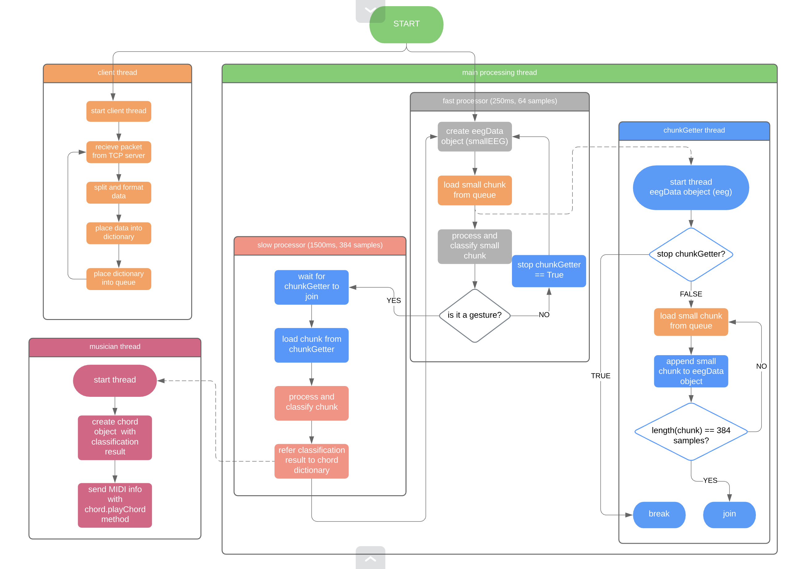

The current iteration of the real-time application consists of a multithreaded process. A flowchart describing the real-time processing work flow is described below.

In the client thread, a TCP client receives single EEG data packets from a live EEG stream using the EPOC+. Each packet is placed into a python queue, waiting to be retrieved by the main processing thread when requested.

In the main processing thread, a helper chunkGetter thread takes care of receiving EEG packets from the client thread and placing them into smallChunks and bigChunks for processing by smallBrain and bigBrain, respectively. Once the smallChunk array is full (250ms, 64 samples), the chunk is sent through preprocessing and feature extraction, and is classified into either a facial expression/no facial expression. While the smallChunk array goes through preprocessing and feature extraction, the chunkGetter thread takes care of filling up the bigChunk array, in case the smallBrain classifier indicates that a facial expression is present and a 320-sample chunk is needed for complete facial expression classification.

If the smallChunk classification indicates that a facial expression was just performed, the main thread waits for the chunkGetter thread to finish collecting all 320 samples into a bigChunk, and sends the bigChunk to be processed and classified using bigBrain. The classification result is sent to a musician thread, which in turn performs the predefined MIDI event indicated by the facial expression-MIDI dictionary.
